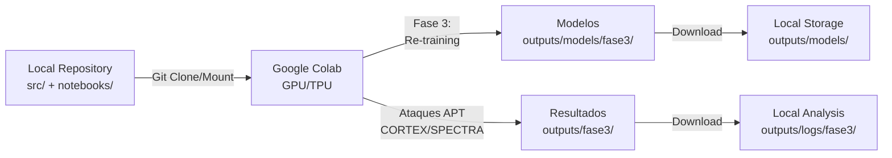

# Arquitectura del Proyecto - Ingeniería de Software

## 1. Descripción General

El proyecto está estructurado siguiendo un enfoque modular y basado en fases experimentales, con una clara separación entre:
- **Componentes locales**: Código fuente, configuración y notebooks de experimentación
- **Ejecución remota**: Entrenamiento de modelos y ataques avanzados en Google Colab
- **Gestión de datos**: Pipeline ETL con separación entre datos raw y procesados

---

## Estructura de Directorios

```
Codigo_TFG/
├── 📁 src/                           # Código fuente principal (Python)
│   ├── config.py                      # Configuración central (Hiperparámetros y variables)
│   ├── data_pipeline*.py              # Pipeline ETL (buffer, surrogate, poc)
│   ├── evaluator.py                   # Evaluación de modelos
│   ├── helpers.py                     # Utilidades compartidas
│   ├── ip_behavior_buffer.py          # Buffer de comportamiento de IP
│   │
│   ├── 📁 models/                    # Arquitecturas de modelos
│   │   ├── Tabular ResNet 
│   │   ├── VAE 
│   │   └── LightGBM
│   │
│   ├── 📁 attacks/                   # Framework de ataques adversariales
│   │   ├── base_attacks.py                          # Clase base abstracta
│   │   ├── fgsm.py, pgd.py, sgfp.py, sigma.py       # Ataques clásicos para estudio (Categoría 1)
│   │   ├── ace.py, dla.py, leaf.py, thorn.py        # Ataques avanzados (Categoría 2)
│   │   ├── s3m_Attack.py, lsf.py, tcp_framework.py  # Ataques multiparadigma (Categoría 4)
│   │   └── descartados/                             # Ataques experimentales
│   │
│   ├── 📁 scripts/                   # Herramientas auxiliares
│   │   └── dataset_scanner.py
│   │
│   └── 📁 utils/                     # Utilidades generales
│
├── 📁 notebooks/                     # Experimentación
│   ├── 01_EDA_Visualizacion.ipynb
│   ├── 02_Entrenamiento_ResNet.ipynb
│   ├── 03_Entrenamiento_LightGBM.ipynb
│   │
│   ├── 04_Ataques_Etapa1_Estudio_Ablacion.ipynb
│   ├── 05_Ataques_Etapa2_Ataques_Avanzados.ipynb
│   ├── 06_Ataques_Etapa3_Ataques_Reales.ipynb      # SPECTRA
│   ├── 07_Ataques_Etapa3b_Ataques_Reales.ipynb     # CORTEX
│   ├── 08_Ataques_Etapa4_Nuevos_Paradigmas.ipynb   
│   |
│   ├── 09_Adversarial_Training_ResNet.ipynb
│   ├── 10_Adversarial_Training_ResNet_VAE_*.ipynb
│   │
│   ├── 📁 outputs/logs/              # Logs locales
│   └── 📁 prueba de concepto/        # POC aislados
│
├── 📁 data/                          # Gestión de datos
│   ├── 📁 raw/                       # Datos sin procesar
│   │   ├── BigFlow-NIDS/              # 66 parquets (por cada millon de flujos)
│   │   └── NF-UQ-NIDS-V2/             # unico parquet con todos los flujos
│   │
│   └── 📁 processed/                 # Datos procesados en las tres etapas (npy)
│       ├── ataques_s3m/             
│       ├── ataques_s3m_sgl/
│       ├── ataques_zero_days/
│       ├── resultados_1_poc/
│       ├── resultados_2_buffer/      
│       ├── resultados_3_surrogate/
│       └── resultados_lgbm/
│
├── 📁 outputs/                       # Artefactos de ejecución
│   ├── 📁 models/                    # Pesos entrenados
│   │   ├── best_resnet.pt
│   │   ├── vae.pt
│   │   ├── 📁 resnet/
│   │   │   └── 📁 at/                # Re-entrenamiento Fase 3 (Colab)
│   │   │       ├── prepare_*.py      (Preparación de datos)
│   │   │       ├── *_trainer.py      (Scripts de entrenamiento)
│   │   │       ├── model_resnet.py   (Arquitectura ResNet)
│   │   │       └── vae_anomaly_detector_v2.py
│   │   ├── 📁 fase3/                 # Checkpoints descargados de Colab
│   │   ├── 📁 fase3_exp/
│   │   ├── 📁 lgbm/
│   │   └── 📁 vae + mahalanobis/
│   │
│   ├── 📁 metrics/                   # Historial de entrenamiento
│   │   ├── historial_resnet_completo.csv
│   │   └── historial_trees_completo.csv
│   │
│   ├── 📁 logs/                      # Logs de ejecución
│   │   ├── training_log_1.txt
│   │   ├── training_log_2.txt
│   │   ├── training_log_3.txt
│   │   └── 📁 fase3/                 # Logs Colab (Fase 3)
│   │
│   ├── 📁 attack_objects/            # Objetos de ataques serializados
│   ├── 📁 checkpoints_ataques/       # Checkpoints durante ataques
│   ├── df_resnet_study.csv           # Resultados ResNet
│   └── df_trees_study.csv            # Resultados LightGBM
|
├── 📁 utils/                         # Utilidades generales
│   └── domain_constraints.py         # restricciones físicas para etapa 2 de ataques
│
```

---

## 4. Componentes Principales

| Componente | Ubicación | Responsabilidad | Ejecución |
|-----------|-----------|-----------------|-----------|
| **Data Pipeline** | `src/data_pipeline*.py` | ETL, normalización, feature engineering | Local + Colab |
| **Modelos** | `src/models/` | ResNet, VAE, LightGBM arquitecturas | Local + Colab |
| **Framework de Ataques** | `src/attacks/` | Métodos adversariales (8+ ataques) | Local + Colab |
| **Evaluador** | `src/evaluator.py` | Cálculo de métricas de robustez | Local |
| **Notebooks Etapa 1-2** | `notebooks/0[4-5]_*.ipynb` | Experimentación local iterativa | Local (GPU disponible) |
| **Colab Fase 3** | Google Colab (sincronizado) | Fase de re-entrenamiento y ataques APT | Cloud (GPU/TPU) |
| **Visualización** | `visuals/app_demo.py` | Interface para exploración de resultados | Local |

---

## 5. Integración con Google Colab

### Fase 3: Re-entrenamiento y Ataques Avanzados



**Archivos sincronizados desde Colab:**
- `outputs/models/fase3/` - Checkpoints entrenados
- `outputs/logs/fase3/` - Logs de ejecución

---

## 6. Pipelines de Datos

### Pipeline General
```
Raw Data → Validación → Normalización → Feature Selection → 
Train/Val/Test Split → Almacenamiento Procesado
```

### Pipelines Especializados
- **Buffer Pipeline**: Gestión de muestras críticas
- **Surrogate Pipeline**: Modelos sustitutos para optimización

---

## 7. Stack Tecnológico

| Capa | Tecnologías |
|-----|------------|
| **Modelos ML** | PyTorch (ResNet, VAE), LightGBM, Scikit-learn |
| **Ataques Adversariales** | Framework propio (base_attacks.py) |
| **Procesamiento de Datos** | Pandas, NumPy, Scikit-learn |
| **Experimentación Local** | Jupyter Notebooks, GPU local |
| **Ejecución Remota** | Google Colab (GPU/TPU) |
| **Visualización** | Matplotlib, Plotly, Streamlit (app_demo) |
| **Control de Versiones** | Git (implícito) |

---

## 8. Convenciones de Nomenclatura

### Archivos de Modelos
```
{arquitectura}_{descripción}.pt
Ejemplo: best_resnet.pt, vae.pt
```

### Datos Procesados
```
ataques_{método_ataque}_{etapa}/
Ejemplo: ataques_s3m/, ataques_zero_days/
```

### Logs y Métricas
```
fase{número}_experiment{id}/
Ejemplo: fase3/, fase3_exp/
```

---

## 9. Flujo de Desarrollo Recomendado

1. **Prototipado Local** (Etapas 1-2)
   - Notebooks iterativos
   - Validación con GPU local si disponible
   - Checkpoints en `outputs/models/`

2. **Escalado a Colab** (Fase 3)
   - Sync con repositorio
   - Ejecución de re-training
   - Ejecución de ataques APT
   - Descarga de artefactos

3. **Análisis de Resultados**
   - Consolidación en `outputs/`
   - Visualización con `app_demo.py`
   - Documentación en memoria TFG

---

## 10. Gestión de Artefactos

| Tipo | Ubicación | Propósito |
|------|-----------|----------|
| Modelos entrenados | `outputs/models/` | Checkpoints para carga posterior |
| Métricas de entrenamiento | `outputs/metrics/` | Análisis de convergencia |
| Logs de ejecución | `outputs/logs/` | Debugging y trazabilidad |
| Datos de ataques | `outputs/attack_objects/` | Serialización de ataques |
| Predicciones | `outputs/` | CSVs con resultados |

