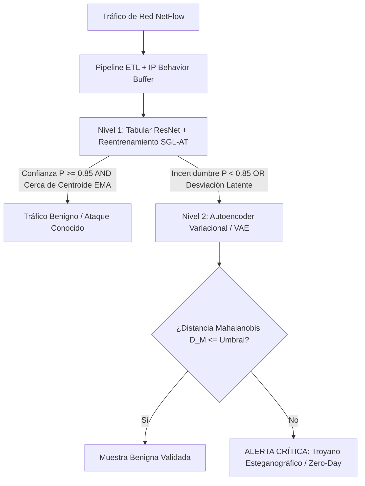
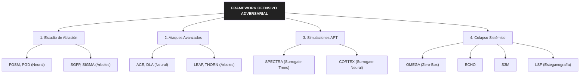
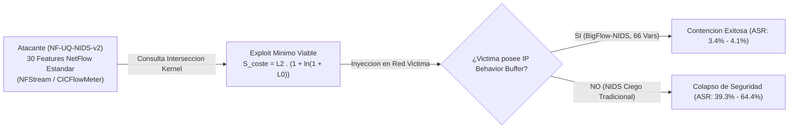

# Análisis, Explotación y Mitigación de Vulnerabilidades de Sistemas de Detección de Intrusiones basados en Machine Learning

> **Trabajo Fin de Grado (TFG) — Universidad de Zaragoza (2026)**  
> **Autor:** Daniel Gomollón Embid  
> **Director:** José Roldán Gómez  

---

## Resumen

La adopción masiva de algoritmos de **Machine Learning (ML)** y **Deep Learning (DL)** en los *Sistemas de Detección de Intrusiones (IDS)* perimetrales contrasta fuertemente con su vulnerabilidad frente a **perturbaciones adversariales** diseñadas para evadir la clasificación en producción. 

Este proyecto investiga la resiliencia de dos paradigmas tabulares contrapuestos: **modelos de partición ortogonal (LightGBM)** y **modelos de frontera continua (Tabular ResNet)**. Para evaluar su solidez real en entornos industriales:
1. Se implementa un **pipeline de datos de grado industrial** sobre el dataset **BigFlow-NIDS** (66.9M de flujos, submuestreado a 1.07M para train) con un **IP Behavior Buffer** que captura contexto temporal asíncrono respetando la causalidad estricta para evitar fugas de datos (*data leakage*).
2. Se somete al sistema a un **framework ofensivo iterativo compuesto por 12 ataques adversariales y 2 simulaciones de APT** en caja gris con un **motor de restricciones físicas de red** (*domain constraints*), demostrando que los ataques puramente matemáticos de laboratorio fracasan al imponer las leyes del protocolo TCP/IP, pero que el **camuflaje semántico (S3M/LSF)** logra perforar las defensas base (>96% ASR).
3. Como contramedida, se propone una **arquitectura defensiva asimétrica en cascada** que combina un modelo continuo reentrenado con **SGL-AT (Stochastic Geometric Latent Adversarial Training)** y un **Autoencoder Variacional (VAE)** con detección por **distancia de Mahalanobis híbrida**, reduciendo la evasión crítica y detectando el 98.1% de amenazas de día cero (*zero-day*).

---

## Arquitectura del sistema defensivo en cascada

El sistema procesa el tráfico a alta velocidad mediante un mecanismo de **inspección por niveles gobernado por enrutamiento dinámico**:

## Framework Ofensivo (12 Ataques + 2 Simulaciones APT)

Los ataques desarrollados se estructuran en 4 categorías progresivas:

## Desglose de ataques

| Categoría | Algoritmo | Paradigma Ataque | Escenario | Descripción |
| --- | --- | --- | --- | --- |
| 1. Ablación Clásica | FGSM / PGD | Gradient Descent | Caja Blanca | Perturbación iterativa por gradiente (Tabular ResNet). |
|  | SGFP / SIGMA | SHAP-Guided | Caja Blanca | Navegación heurística aditiva en cortes de decisión (LightGBM). |
| 2. Avanzados | THORN | Root Navigation | Caja Blanca | Explotación de umbrales ortogonales compartidos en nodos raíz. |
|  | LEAF | Activation Frontier | Caja Blanca | Salto directo de ramas con inercia tolerante en ensambles. |
|  | ACE | Causal Momentum | Caja Blanca | PGD con Causal Momentum Reset (μ=0.0) ajustado a restricciones. |
|  | DLA | Latent Collision | Caja Blanca | Secuestro del espacio latente mediante forward hooks en capas profundas. |
| 3. Simulaciones APT | SPECTRA | Surrogate NetFlow | Caja Gris | Transferencia de ataques ortogonales usando dataset surrogate NF-UQ-NIDS-v2. |
|  | CORTEX | Surrogate Neural | Caja Gris | Búsqueda de exploit mínimo viable con la métrica de Coste Compuesto Scoste. |
| 4. Colapso Sistémico | OMEGA | Extractor Inversion | Zero-Box | Alteración de varianza temporal (+1542%) mediante retardo de 1 paquete. |
|  | ECHO | Uncertainty Shift | Caja Blanca | Inundación de muestras en zona de neutralidad (P≈0.5) para fatiga del SOC. |
|  | S3M | Semantic Camouflage | Caja Gris | Inyección de troyanos sintéticos ajustando el Minimum Camouflage Ratio (MCR). |
|  | LSF | Steganography | Caja Gris | Esteganografía latente combinando carga parásita (PPE) y calibración (TCC). |

## Resultados Experimentales Clave

### 1. Paridad Nominal y Corrección Bayesiana (Fase 1)

Tras aplicar el ajuste de prior bayesiano 𝜋 = 0.15 para simular el desbalanceo real de producción (95% benigno, 5% ataque), ambos clasificadores convergieron a un rendimiento prácticamente idéntico:

| Modelo | F1‑Macro |
| --- | --- |
| LightGBM | **0.9500** |
| Tabular ResNet | **0.9501** |

### 2. Impacto de las Restricciones Físicas de Red (Fase 2)

El motor de restricciones (domain_constraints.py) reveló que solo 21 de las 66 características son realmente perturbables por el atacante (8.7% del peso SHAP).

Rendimiento de ataques clásicos:

| Configuración | ASR |
| --- | --- |
| **Sin restricciones (Física OFF)** | Hasta **97.0%** ASR |
| **Con restricciones (Física ON)** | < **8.4%** ASR |

Esto demuestra que los ataques de laboratorio convencionales corrompen la semántica del protocolo TCP/IP, inflando artificialmente la vulnerabilidad del sistema.

### 3. Simulaciones APT en Caja Gris y Peligrosidad Real (SPECTRA y CORTEX)

Las simulaciones SPECTRA (ensambles de árboles vía THORN/LEAF) y CORTEX (redes profundas vía ACE/DLA) evalúan la peligrosidad real bajo condiciones de producción, exponiendo las brechas de extractores tradicionales como NFStream, CICFlowMeter o YAF.

- Asimetría Espacial y Kernel de Características: El atacante entrena modelos subrogados en un dataset público estandarizado (NF-UQ-NIDS-v2, 30 variables NetFlow puras), ignorando las 15 variables del IPBehaviorBuffer de la víctima (BigFlow-NIDS, 66 variables).

- Búsqueda del Exploit Mínimo Viable ($S_{\text{coste}}$): Se optimiza la función de coste compuesto para maximizar el sigilo:
    - $$S_{\text{coste}} = L_2 \cdot \left(1 + \ln(1 + L_0)\right)$$

Esta formulación penaliza la energía total de la perturbación ($L_2$) y premia alterar la menor cantidad de variables ($L_0$).

- Peligrosidad de Extractores Sin Estado: Cuando el IDS activa el búfer histórico, la tasa de transferencia cae al $3.4\% - 4.1\%$. Sin embargo, al suprimir el búfer (simulando extractores sin persistencia de estado) la evasión se dispara hasta un 39.3% en LightGBM y un 64.4% en Tabular ResNet.

### 4. Mitigación con Defensa en Cascada (Fase 3)

Frente a ataques esteganográficos y de camuflaje de sesión (S3M / LSF), el enrutamiento dinámico en cascada mostró una mejora sustancial.

Comparativa de Defensa:

| Vector de Ataque | Sin Defensa (ResNet Base) | Con SGL‑AT (Sin Cascada) | Cascada Total (SGL‑AT + VAE) |
| --- | --- | --- | --- |
| FGSM | 43.5% ASR | 16.9% ASR | **1.2% ASR** |
| PGD | 56.2% ASR | 38.6% ASR | **8.4% ASR** |
| ACE | 52.7% ASR | 3.6% ASR | **0.0% ASR** |
| DLA | 69.7% ASR | 6.0% ASR | **2.4% ASR** |
| LSF (Esteganografía) | 96.1% ASR | 75.9% ASR | **31.3% ASR** |
| S3M (Camuflaje) | 98.8% ASR | 100.0% ASR | **67.5% ASR** |
| Detección Zero‑Day (Worms) | 85.4% Recall | 94.3% Recall | **98.1% Recall** |

## Licencia y Propiedad Intelectual

Este proyecto y los algoritmos contenidos en él (incluyendo el pipeline de datos, el buffer de contexto por IP, el algoritmo de reentrenamiento adversarial SGL-AT, la arquitectura defensiva en cascada con VAE, así como todos los algoritmos de ataque y orquestadores SPECTRA/CORTEX) están protegidos por derechos de autor.

Este repositorio se distribuye bajo la licencia Academic and Non-Commercial Source-Available License. Se permite su uso, consulta y reproducción únicamente con fines académicos, educativos, de evaluación e investigación personal no comercial. Queda expresamente prohibida cualquier explotación comercial, redistribución o desarrollo derivado sin la autorización previa y por escrito del autor.
